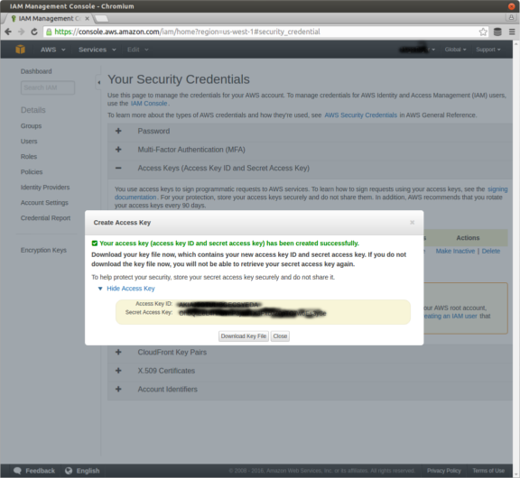

# Cloudsim Portal

This is the portal server for Cloudsim

## What is this repository for? ##

* A web app that manages simulators on the cloud
* Has different types of users (to create, share and start simulation runs)
* Launches new AWS gpu instances with simulators and field computers
* Must be run from an AWS instance when using SSL certificates

## Prerequisite ##

### AWS Setup ###

You will need AWS credentials to launch instances on AWS.

Get the AWS keys (AWSAccessKeyId and AWSSecretKey) from the AWS console.

An important configuration is to upload or create a "Key Pair" in each
region where you want to launch simulator machines. That key must be called `cloudsim`.

AWS will put the public key in the simulator machine you launched so that you
can ssh into the machine by doing:

    ssh -i cloudsim.pem ubuntu@ip_address

Add two security groups (names are important):

* `cloudsim-portal`

  Inbound rules:

    HTTPS / TCP / 443 / Anywhere
    SSH  / TCP / 22 / Anywhere
    All ICMP / ICMP / 0-65535 / Anywhere
    Custom TCP Rule / TCP / 5050 / Anywhere

* `cloudsim-sim`

  Inbound rules:

    HTTPS / TCP / 443 / Anywhere
    SSH  / TCP / 22 / Anywhere
    All ICMP / ICMP / 0-65535 / Anywhere
    Custom UDP Rule  / UDP / 1194 / Anywhere

## Launch an instance on the AWS server for the cloudsim portal ##

There are different ways to start an AWS instance to host the cloudsim portal

Option 1)

You can do it manually using the AWS EC2 console. Make sure to assign the
right security group (`cloudsim-portal`) and choose the key pair (`cloudsim`) you created.

Option 2)

This package contains a script to launch an AWS instance from the command line
with the `cloudsim-portal` security group and the `cloudsim` key.

To use this script, you will need to first setup the AWS environment variables,
see Environment variable setup section below.

Use the `launch_portal.js` script to launch a new AWS instance.

    node launch_portal.js cloudsim empty.bash

You should see the ip address printed when the machine is launched.

### Configure cloudsim portal instance ###

Once the new aws instance is up and running, ssh into the machine:

    ssh -i cloudsim.pem ubuntu@ip_address

Change the hostname to `portal`

    sudo su
    echo "portal" > /etc/hostname
    echo "127.0.1.1 portal" >>  /etc/hosts

Setup the iptable to redirect port 443 (HTTPS) to 4000 (cloudsim portal server).
This won't survive a reboot unless you put this in
`/etc/rc.local`

    iptables -t nat -A PREROUTING -i ens3 -p tcp --dport 443 -j REDIRECT --to-port 4000

## Installation ##

### Dependencies ###

#### nodejs ####

You need the following: nodejs (version 4 and up) and gulp

If you are running Ubuntu Trusty or older distributions, you should install using nodesource:

    curl https://deb.nodesource.com/setup_4.x | sudo -E bash -

Otherwise, install using apt-get:

    sudo apt-get install -y nodejs nodejs-legacy npm redis-server mercurial
    sudo npm install -g gulp

#### MongoDB ####

https://docs.mongodb.com/manual/installation/

### Setup the portal ###

From the root directory

    npm install

### Environment variable setup ###

In order for the portal to launch a simulator machine, valid AWS access keys are needed. Create a `.env` file and add the follwing but replace the XXX with your AWS keys:

    AWS_ACCESS_KEY_ID=XXXXXXXX
    AWS_SECRET_ACCESS_KEY=XXXXXXXXXX

These environment variables must be loaded in the shell that runs the portal web app (the keys are used to launch
 simulation machines)

For security purposes, all sockets and REST API's are protected. Set up the public key needed to decode json web tokens. Edit and `.env` file and add the following variable. Replace XXX with the actual public key.

    CLOUDSIM_AUTH_PUB_KEY=XXXXXXXX

### Run the portal ###

From the command line:

    gulp

gulp starts the portal http server and you should be able to access it by going
to:

https://ip_address:4000 (if port 4000 is open)

https://ip_address (if the port 4000 is redirected to 443)

## Testing ##

### How to run tests ###

    gulp test

This sets the `NODE_ENV` environment variable to `test` and uses fake cloud services.
No AWS instances will be launched.

### AWS dry-run ###

AWS cloud services supports dry runs. Declare a `CLOUDSIM_DRY_RUN` variable in the `.env` file and set it to `true`. All AWS cloud services will be called with `DryRun` enabled.

### Fake cloud services ###

The difference between fake cloud services and AWS dry-run is that the fake cloud services does not actually make any services calls to the AWS provider. Instead, fake cloud service calls return immediately as if machines were successfully launched.

To use fake cloud services, comment out the `AWS_ACCESS_KEY_ID` environment variable.in the `.env` file.

## Deployment instructions ##

## Contribution guidelines ##

## Who do I talk to? ##

* Repo owner or admin: hugo@osrfoundation.org
