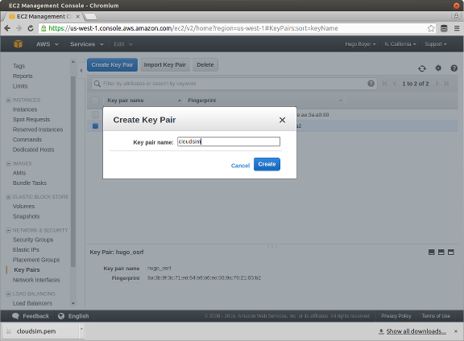

# README #

This is the portal server for Cloudsim

### What is this repository for? ###

* A web app that manages simulation runs (create, view log)
* Has different types of users (to create, share and start simulation runs)
* Launches new AWS gpu instances with simulators and field computers
* Must be run from an AWS instance when using SSL certificates

### AWS Setup ###

You need AWS keys (AWSAccessKeyId and AWSSecretKey). Get them from the AWS
console.

 Then you must prepare your environment variables.
Create a .env file and add the follwing but replace the xxx with your aws keys:

`AWS_ACCESS_KEY_ID=XXXXXXXX
 AWS_SECRET_ACCESS_KEY=XXXXXXXXXX`

These environment variables must be loaded:

* in the shell that runs the portal web app (the keys are used to launch
 simulation machines)
* in the terminal you use to launch a new portal

Another important configuration is to upload or create a "Key Pair" in each
region where you want to launch machines. That key must be called "cloudsim".

If you created the key file then when ssh'ing to the machine you'll need to do:

`ssh -i cloudsim.pem ubuntu@ip_address`

Add two security groups (names are important):

* cloudsim-sim

Inbound rules:

HTTPS / TCP / 443 / Anywhere
SSH  / TCP / 22 / Anywhere
All ICMP / ICMP / 0-65535 / Anywhere
Custom UDP Rule  / UDP / 1194 / Anywhere

* cloudsim-portal

Inbound rules:

HTTPS / TCP / 443 / Anywhere
SSH  / TCP / 22 / Anywhere
All ICMP / ICMP / 0-65535 / Anywhere

#### Launch portal on an AWS server ####

Use the launch_portal.js script to create a new aws instance.

`node launch_portal.js cloudsim empty.bash`

You should see the ip address printed when the machine is launched.

Once the new aws instance is up and running, ssh into the machine:

`ssh -i cloudsim.pem ubuntu@ip_address`

Change the hostname to `portal`

~~~
sudo su
echo "portal" > /etc/hostname
bonus: echo "127.0.1.1 portal" >>  /etc/hosts
~~~

Setup the iptables. This won't survive a reboot unless you put this in
`/etc/rc.local`

`bash port_redirect.bash`

#### Install the dependencies ####

You need the following: nodejs (version 4 and up) and gulp

* If you are running Trusty, you should use with nodesource:
curl https://deb.nodesource.com/setup_4.x | sudo -E bash -

to install nodejs:

`sudo apt-get install -y nodejs nodejs-legacy npm redis-server mercurial
sudo npm install -g gulp`

Install MongoDB

https://docs.mongodb.com/manual/installation/

some useful mongo commands:

$ mongo

> show dbs
> use cloudsim-portal
> db.users.find().pretty()
> db.simulators.find().pretty()
> db.simulations.find().pretty()

### Setup the portal ###

From the root directory

* npm install
* gulp

gulp starts the portal http server and you should able to access it by going
to:

https://ip_address:4000 (if port 4000 is open)

https://ip_address (if the port 4000 is redirected to 443)

* Database configuration: Redis for now
* How to run tests: gulp test

### Deployment instructions ###

### Contribution guidelines ###

### Who do I talk to? ###

* Repo owner or admin: hugo@osrfoundation.org
